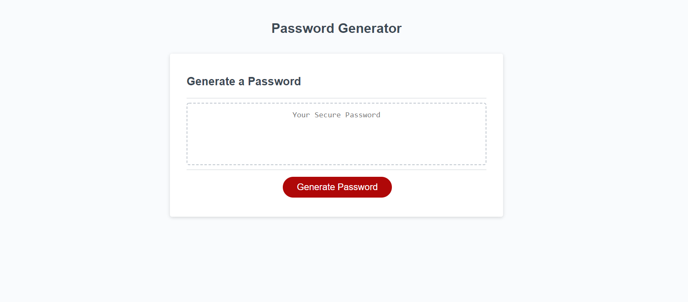
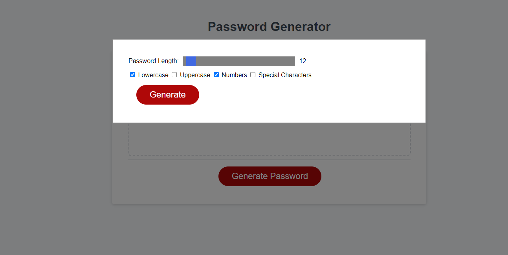
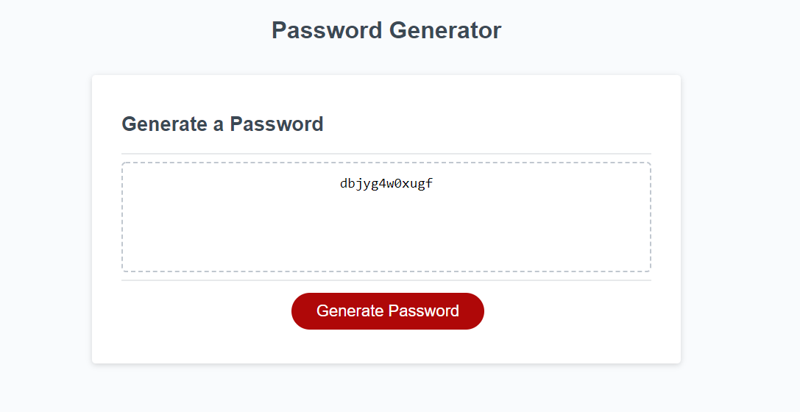

## PasswordGeneratorJavaScript

# Description

A random password generator that can create a random string between 8 and 128 characters.
the user can select which type of characters to use in the password.

in this project I learned how to link html css and javascript togeather and how they interact with eachother.
I built the generator code with the first fuctonal idea that came to me.
it solves how to randomly generate a string and how to just javascript to change html text.

# Usage

load the webpage and then click the generate password button. doing so will open a model that prompts for password length and has checkboxes for the character types that can be used.
then once the generate button is pressed then a random password will be generated adn displayed on the screen in the text area.

you can keep repeating the password generation as many time as wanted.

# Link

[https://ajurgs.github.io/PasswordGeneratorJavaScript/](https://ajurgs.github.io/PasswordGeneratorJavaScript/)

# Screenshots

